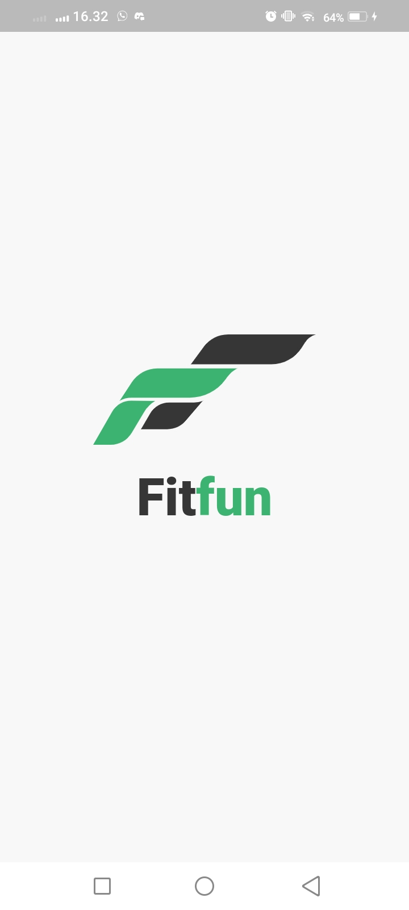
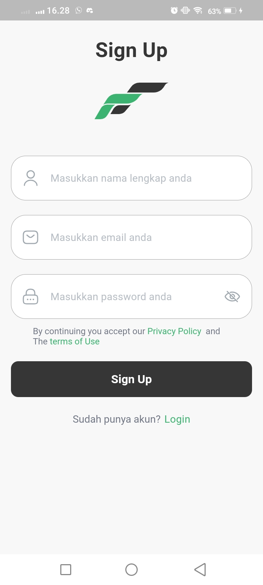
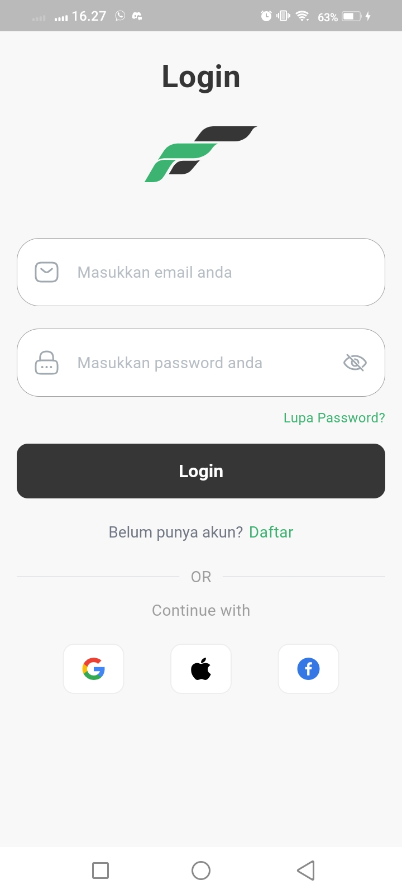
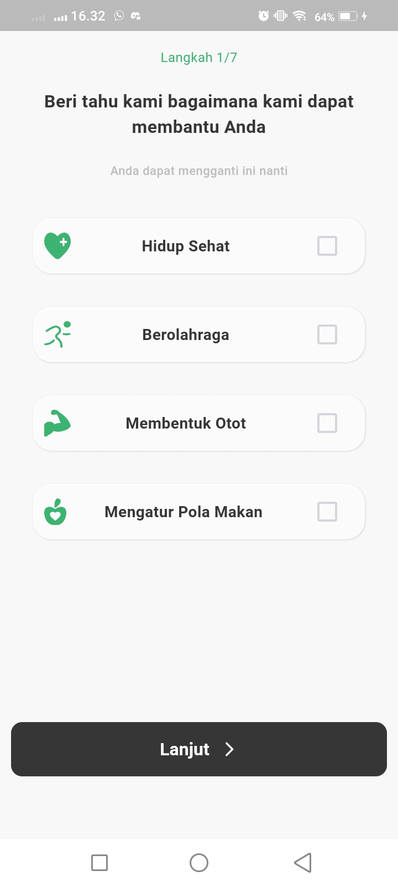
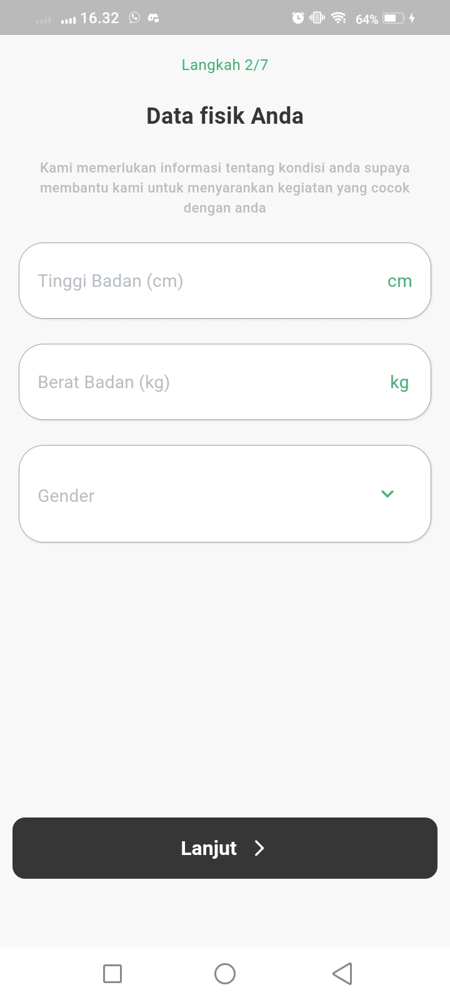
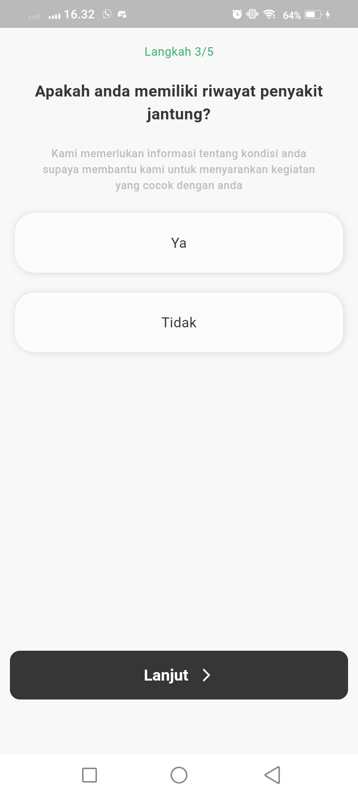
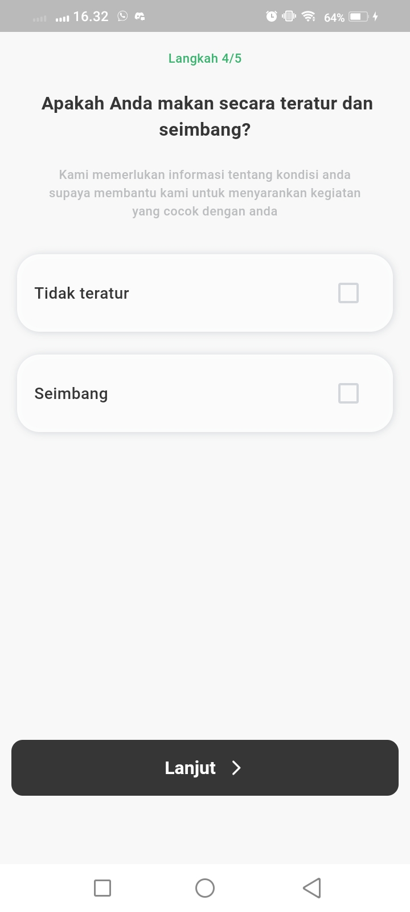
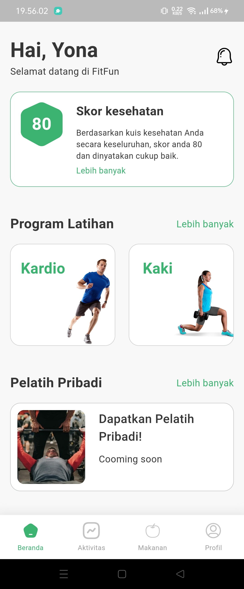
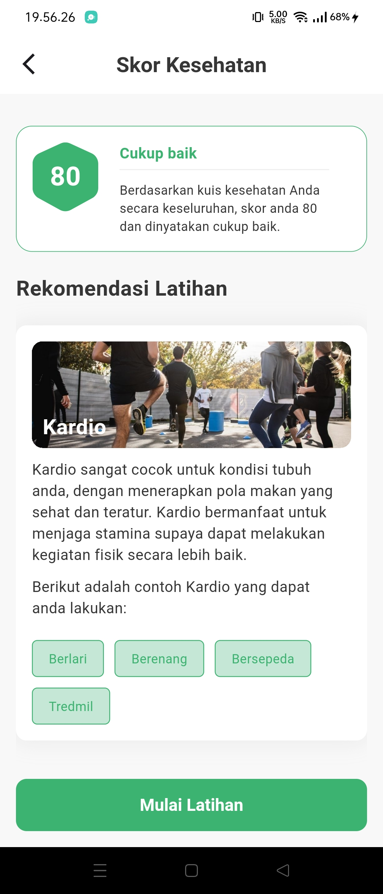

<h1 align="center">
  Hahu_hoheng Fitfun
</h1>

## Konten
- [Introduction](#pengenalan)
- [Image Results](#Hasil-Gambar)
- [Fitur](#Fitur)
- [Technology](#Teknologi-yang-digunakan)
- [Dependensi](#Dependensi)
- [Contacs](#Kontak)

## Pengenalan
Hallo everyone, From existing problems related to sports and health such as the following:
1. Lack of motivation to exercise and need guidance
2. Unhealthy lifestyle & lack of movement
3. Limited access to learn about fitness & affordability

We provide a solution, namely a mobile-based system in which machine learning is also used to provide the best recommendations for users regarding sports and user needs from data and problems obtained from the users themselves.

This system is based on a mobile app which was built using Flutter technology with artificial intelligence (machine learning) and also utilizes Firebase as data storage.

## Hasil Gambar
Splash Screen | Register Screen | Login Screen | Quiz Screen | Home | Personalized Result Screen |
:----------:|:----------:| :----------:| :----------:| :----------:| :----------: |
 |  |  |    |  |  |
## Fitur
- Splash Screen
- Register Screen
- Login Screen
- Quiz Screen
- Home Screen
- Personalized Result Screen

## Teknologi yang digunakan
- Flutter
- Dart
- Firebase

## Dependensi
- [get_storage](https://pub.dev/packages/get_storage)
- [get](https://pub.dev/packages/get)
- [google_fonts](https://pub.dev/packages/google_fonts)
- [flutter_svg](https://pub.dev/packages/flutter_svg)
- [cloud_firestore](https://pub.dev/packages/cloud_firestore)
- [firebase_auth](https://pub.dev/packages/firebase_auth)
- [firebase_core](https://pub.dev/packages/firebase_core)
- [flutter_native_splash](https://pub.dev/packages/flutter_native_splash)

## Kontak
Jika anda memiliki pertanyaan silahkan hubungi kami melalui email di:
1. Rahmad Ageng Handoko(agenghandoko@gmail.com)
2. Siswadi Perdana Putra (danaperdanaputra32@gmail.com)
3. Yonathan setianto (yonaxtava36@gmail.com)
4. Muhammad Rafli Silehu (raflisilehu20@gmail.com)

